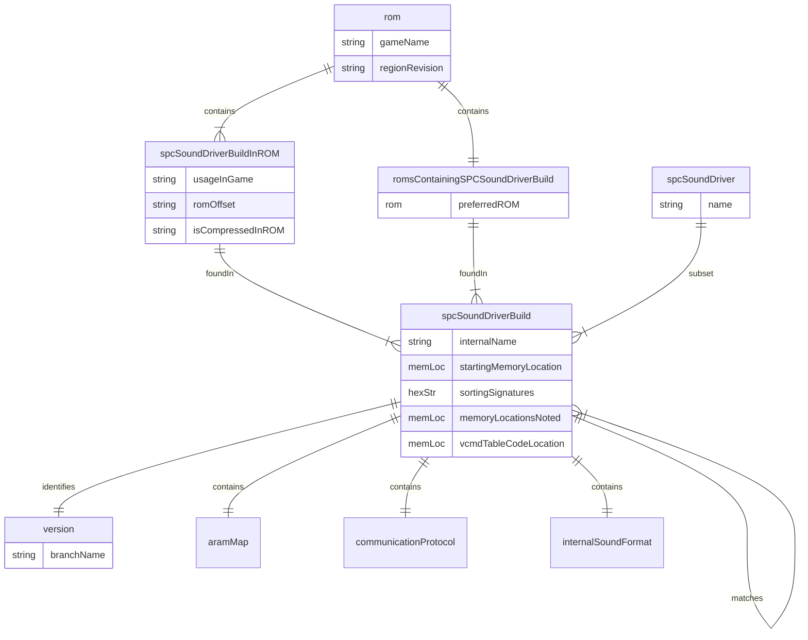

This file documents the internal structure that is planned. Yes, you'll notice it's planned out like a database... except that I don't want to deal with the shenanigans of setting up one at this moment due to the limitations of GitHub Pages. Instead, I'll see how JavaScript can handle this.

Before I explain everything, here is a diagram containing the intended relationships:

# ROM
## Game Name
* Contains the name of the game.

## Region/Revision
* Used if the Game Name is not unique, though it can be filled in anyways.

## SPC Sound Driver Build
* One ROM can contain multiple [SPC Sound Driver Builds](#spc-sound-driver-build-2). Naming schemes may vary, but generally I go by game name followed by the region/revision (the latter case only if the game name is not unique). Each sound driver build in the ROM can also contain the following...

### Usage In Game
* Used if there is more than one unique [SPC Sound Driver Build](#spc-sound-driver-build-2) in the ROM.

### ROM Offset
* Is usually represented as a memory location as the SNES would read the ROM for. Note that this is preferably done from either the first opcode or, in the case of a block-based format (the code must be first in the block, or in some way is not too covered by data), the location of the 

### Is Compressed in ROM
* Defaults to No. If this is defined, it either contains the format it is compressed in, or generally says that it is compressed (and the format has not yet been identified, or could even be custom).

# SPC Sound Driver
## Name
* Represented as a string. Either refers to the earliest developer to use the sound driver, the programmer of the sound driver (both can be included), or sometimes the composer that most commonly used the sound driver. If this is not provided, "Unknown" with a numerical identifier is used.

## SPC Sound Driver Build
* A SPC Sound Driver can have multiple [builds](#spc-sound-driver-build-2).

# SPC Sound Driver Build

## Internal Name
* Display name for a sound driver build. Can either refer to a preferred ROM or can be its own name. In the latter case, it overwrites the preferred ROM as the display name.

## Starting Memory Location
* Provided as a SPC700 ARAM location. This contains the starting location of the entire program.

## Sorting Signature(s)
* Represented as a string containing the raw hexadecimal bytes. Must be SPC700 opcodes. Not counting branching distances (which are usually represented), usually omits opcode parameters to avoid cases where the ARAM map and/or the parameters themselves change.
  * I'll have to figure out how to deal with Konami. There are a lot of unique builds with inconsistent memory locations all around, and they need to be properly represented. They are the most notable ones where I had to do an expert mode of sorts.

## Memory Location(s) Noted
* All SPC700 ARAM locations noted in order. Must refer to a parameter of a CALL opcode or a non-indexed JMP opcode, as in `3F ?? ??` or `5F ?? ??`: other memory locations located after opcodes may not yield any opcode-related differences, and the indexed JMP opcode (`1F ?? ??`) is a more complicated case due to technically being an indirect. If CALL and JMP opcodes are not found, then this part can be omitted entirely and uniqueness can solely rely on the sorting signature... though it could take a lot of bytes to get something.

## Matches
* Refers to another [SPC Sound Driver Build](#spc-sound-driver-build-2). Required if either the [sorting signature](#sorting-signatures) is not provided or the [memory location(s) noted](#memory-locations-noted) in the [sorting signature](#sorting-signatures) are different because of data in the middle of the code being of a different size.
   * If this field is not provided and no sorting signature is provided, the build is presumed unique.
   * If this field is provided, but is an empty set, then the build is also presumed unique. This can happen if the sorting signature has a problem catching non-memory location-based data.

## Version
* Done for sorting purposes, especially when the same build can represent multiple games. Represented as a string. May involve branches.

### Branch Name
* Name referring to a branch this belongs to.

## ROM
* One SPC Sound Driver Build can be found in multiple [ROMs](#rom). In addition, it can have these records...

### Preferred ROM
* Generally refers to the earliest released ROM. Note that if multiple regions are provided and  If this is not provided, then the first alphabetical ROM name is used.

## VCMD Table/Code Location
* The ARAM location of the music voice command table/code as dictated by the internal sound format documentation. Usually refers to the deepest level possible, though there could be exceptions.

# ARAM Map
* Will be dynamically generated on the fly. The entire 65,536 bytes will be noted, but the only things that should be covered here are the variables as well as the code and any data associated with the code that is usually not swapped out and does not vary from ROM to ROM (or, more commonly, game to game, though regional and revisional differences can also lead to data differences).

# Communication Protocol
* All four CPUIO registers must be noted for input and output, as well as when the latches are cleared (which clears out what the SPC700 reads from the SNES).

# Internal Sound Format
* Will vary from build to build and sound driver to sound driver. May contain wrappers, which mean that it leads to a deeper level internal format. Some internal formats are based off non-custom base formats, particularly MIDI.
* N-SPC/Kankichi-kun is by far the most common base sound format for music due to having the most number of unique builds somewhere in the hundreds. It can be subject to many revisions at that, or it could be nearly identical to the source variant.

# Citations
* Noted for the purposes of crediting the researchers.

# Other notes
* I tend to require that disassemblies have some kind of documentation associated with them for the purpose of indicating that some reverse engineering was done on them... otherwise, usually the one thing that disassembling it does is make it easier to identify memory locations being used (though with offset-related complications).
